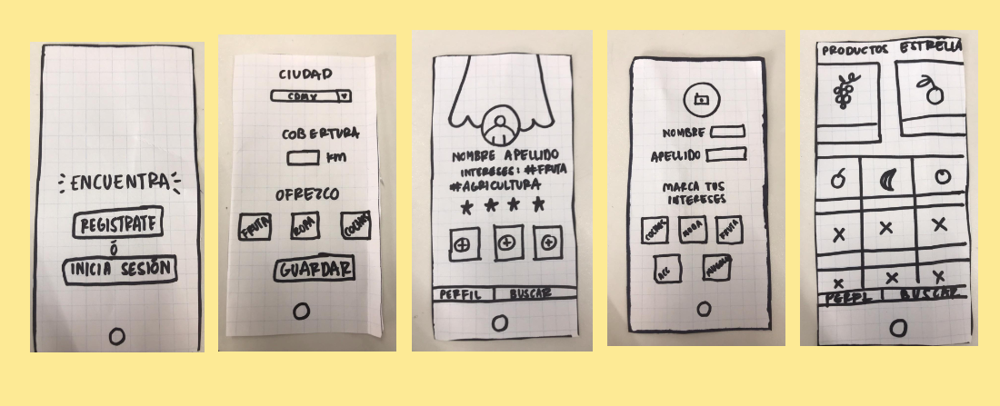

# IBM-Week-Proyecto

# ENCUENTRA

## INTRODUCCIÓN
[Recursos adicionales](https://drive.google.com/drive/folders/1jGMpWZSCEUWBNvt9vGMFLQCDRpD2YOh1)

Para ser emprendedor no es necesario tener capital. Con una buena idea y un buen plan llegan los inversionistas. La idea de Frida se basa en el trueque, una de las de las actividades más antiguas relacionadas con el comercio. [Presentación](https://www.canva.com/design/DADhh9ofZlg/8Z4PBCIbhpkyPtnpCzW0pQ/edit)

Actualmente, el trueque ha llegado a internet bajo el nombre de “sharing economy” o economía colaborativa, un término que se ha convertido incluso en la base de un modelo de negocio usado por compañías que facturan millones de dólares. 

**¿Cómo funciona el modelo?**

Esta basada en la relación persona a persona, que surge ante la necesidad de tener acceso a bienes que no estaban a su alcance ofreciendo a cambio aquellos a los que sí, sin perder de vista el valor que uno le puede dar al otro.

Hoy en día es posible que un viajero pueda dormir de forma gratuita en la casa de una familia local, o usar el sistema de carpooling para viajar en el coche de otra persona. Estas opciones no solo son más económicas que los tradicionales métodos de intercambio comercial, sino que representan un nuevo nivel de eficiencia. 

**Principales beneficios de la economía colaborativa:**

- El ahorro. 

- Desarrollo sostenible. Estimula el segundo uso de los productos. Lo que alguien ya no necesita, puede tener un nuevo destinatario en alguna red de contactos. Se aboga por un consumo moderado.

- Mayor oferta. Los productos con un segundo uso y los servicios compartidos amplían la oferta de los mercados tradicionales. 

- Beneficio medioambiental. La reutilización y los servicios compartidos son una buena manera. Se promociona la cultura de reciclaje. 

Ya existen algunas empresas tecnológicas mexicanas que ofrecen el servicio de intermediarios entre oferentes y demandantes de bienes y servicios sin movimientos de efectivo; sin embargo, **aún no ofrecen una seguridad de entrega satisfactoria de los bienes, así como la confidencialidad de información.**

## DATOS GENERALES

Estudio sobre venta online México 2019 [AMVO](https://www.amvo.org.mx/descarga-estudio-venta-online)

De acuerdo al más reciente estudio de la Asociación Mexicana de Venta Online, los no compradores declararon que 77% de ellos tiene miedo a ser víctima de fraude electrónico.

Asimismo, 4 de cada 10 no compradores cree que el proceso de compra es inseguro.

## USER PERSONA

## ENCUENTRA

**“Encuentra” es una empresa 100% mexicana que se basa en el trueque de productos/servicios vía Internet, proceso que da valor al usuario de acuerdo con sus actividades profesionales, además contribuye a la comunidad y beneficia a las pequeñas y medianas empresas.**

## VALOR DE LA APLICACIÓN WEB

A diferencia del trueque tradicional "Encuentra" no se enfoca en el intercambio de productos/servicios de segunda mano o que se pueden desechar, sino en compartir aquellos que pueden contribuir al crecimiento del otro.

Las ventajas de “Encuentra”, son que no descapitaliza a los usuarios, beneficia el ahorro con el intercambio, y se beneficia a los usuarios potencializando sus habilidades.

 ## ARQUITECTURA

 ### Diagrama de flujo

 El primer paso es registar los datos personales. "Encuentra" cuenta en su home con un Inicio y Registro. En el registro el usuario podrá ingresar también sus intereses.

 Una vez iniciada su sesión el usuario ingresará con foto los productos/servicios que desea intercambiar.
 
 A partir de ahí se realizan dos métodos, el primero es elegir un producto que se necesite y negociar su cambio por otro que ofrecemos. El segundo es esperar a algún candidato que se interese por tu oferta y así intercambiar el artículo. 
 
 El último paso es realizar una cita en un punto específico donde se procederá al cambio físico del servicio, accesorio o aparato que fue ofertado.

 # HISTORIAS DE USUARIO

- Como usuario quiero que mis datos estén protegidos contra todo robo de información
- Como usuario quiero que las personas con las que interactúe sean confiables 
- Como usuario quiero ingresar los productos/servicios que ofrezco y ver los productos/servicios que hay

 ## SEGURIDAD

# PROTOTIPO DE BAJA FIDELIDAD

# PROTOTIPO DE ALTA FIDELIDAD
